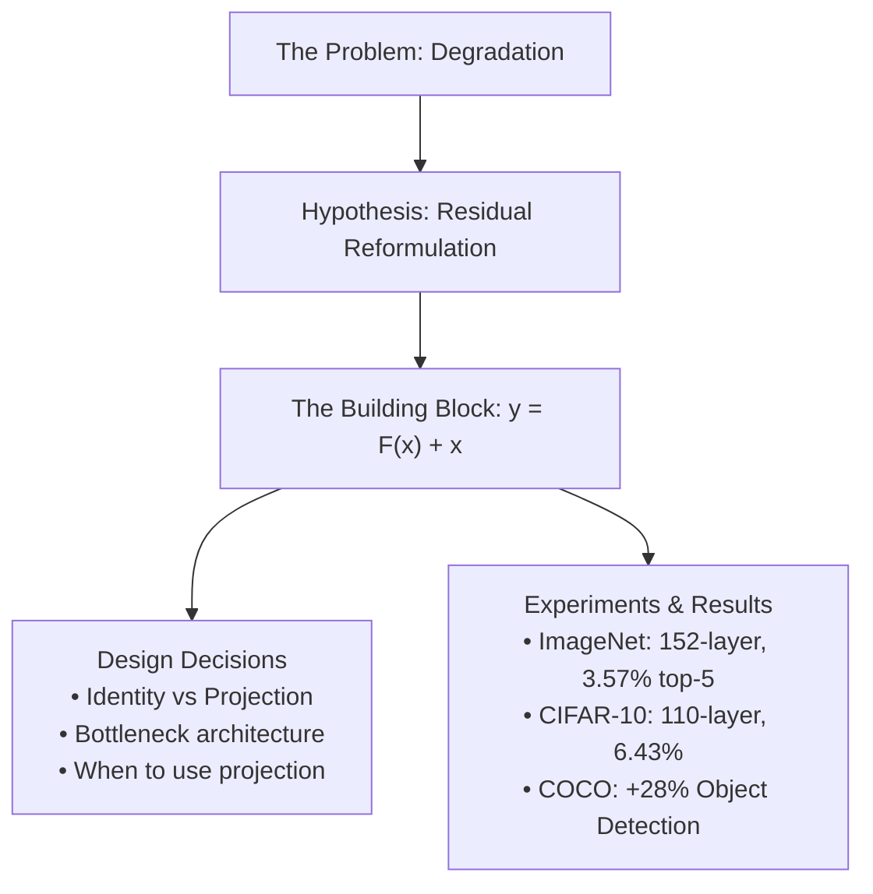
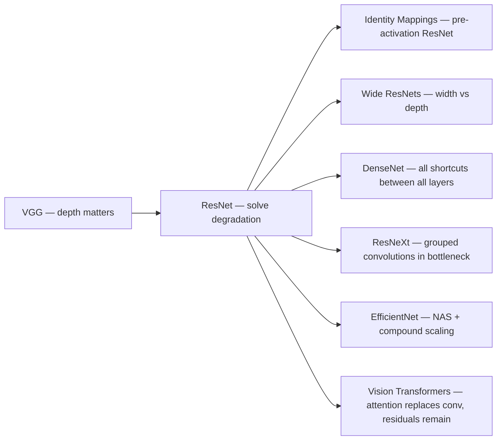

---

tags:

- deep-learning
- computer-vision
- paper-notes
- neural-networks
- optimization aliases:
- ResNet
- He et al. 2015
- Deep Residual Learning paper: "Deep Residual Learning for Image Recognition" authors: "Kaiming He, Xiangyu Zhang, Shaoqing Ren, Jian Sun" venue: "CVPR 2016 (arXiv Dec 2015)" year: 2015 status: read

---

# Residual Networks — Deep Residual Learning for Image Recognition

> [!quote] Core Thesis _"Instead of hoping each few stacked layers directly fit a desired underlying mapping, we explicitly let these layers fit a **residual mapping**."_ — He et al., 2015

---

## 🗺️ Map of the Paper



---

## 1. The Problem: Degradation

### 1.1 What We Expect vs. What Happens

Intuitively, deeper should mean better. A $d+k$ layer network can always _simulate_ a $d$ layer network by setting the extra $k$ layers to identity mappings — so its expressiveness is strictly greater. The solution space of the shallower network is a **subspace** of the deeper one.

Yet empirically:

> [!danger] The Degradation Problem Adding more layers to a working model causes **training error to increase** — not test error, **training** error. This is not overfitting. This is an _optimization failure_.

The paper shows this concretely: a 56-layer plain network has **higher training error** than a 20-layer plain network on CIFAR-10, throughout the entire training procedure.

### 1.2 Why It's Not Vanishing Gradients

The obvious culprit would be vanishing/exploding gradients. But the paper rules this out:

- Batch Normalization ensures **forward signals have non-zero variance**
- Verified that **backward gradients have healthy norms** through BN
- Neither forward nor backward signals vanish

So we have a degradation problem that BN doesn't solve. The paper conjectures:

> _"Deep plain nets may have exponentially low convergence rates, which impact the reducing of the training error."_

The actual theoretical reason is left as future work — the paper is empirically motivated.

### 1.3 The Constructed-Solution Argument

Here is the key logical pressure point in the paper's motivation:

> [!note] Thought Experiment Given a trained $d$-layer network $\mathcal{N}$, construct a $(d+k)$-layer network by:
> 
> - Copying $\mathcal{N}$'s weights for the first $d$ layers
> - Setting the extra $k$ layers to **exact identity mappings**
> 
> This construction achieves the same training error. But solvers cannot find this solution (or solutions equally good) in feasible time.

This suggests the problem is about **optimization landscape geometry**, not representational capacity. Solvers struggle to push layers toward identity when that's what's optimal.

---

## 2. The Residual Reformulation

### 2.1 The Key Insight

If solvers struggle to learn identity mappings through stacked nonlinear layers, change what they're asked to learn.

Let $\mathcal{H}(x)$ be the desired underlying mapping. Instead of learning $\mathcal{H}(x)$ directly, define:

$$F(x) := \mathcal{H}(x) - x$$

Then the original mapping is recovered as:

$$\mathcal{H}(x) = F(x) + x$$

Now, if identity were optimal (i.e., $\mathcal{H}(x) = x$), the solver only needs to **push $F(x) \to 0$**. Driving weights toward zero is much easier than learning an identity through a stack of nonlinearities.

### 2.2 The Geometric Intuition

Think of it as a change of coordinates for the learning problem:

|Standard learning|Residual learning|
|---|---|
|Learn $\mathcal{H}(x)$ from scratch|Learn _perturbation_ $F(x) = \mathcal{H}(x) - x$|
|Identity is hard (weights must conspire to cancel nonlinearities)|Identity is trivial ($F = 0$)|
|If optimal $\approx$ identity, solver must rediscover it|Solver starts _at_ identity, just needs small adjustments|

**Analogy:** It's like the difference between learning "where to go" vs. "how far from here to go." If you're already roughly in the right place, residuals are tiny corrections.

### 2.3 The Building Block

$$\boxed{y = F(x,, {W_i}) + x}$$

Where:

- $x$, $y$ — input and output of the block
- $F(x, {W_i})$ — the **residual function** (the stack of layers)
- $+x$ — the **shortcut connection** (identity, adds zero parameters)

For a two-layer block (as in Fig. 2 of the paper): $$F = W_2 \sigma(W_1 x)$$ where $\sigma$ is ReLU. The nonlinearity after addition: $\sigma(y) = \sigma(F(x) + x)$.

```
┌────────────────────────────────────┐
│         Residual Block             │
│                                    │
│  x ──────────────────────────┐     │
│  │                           │     │
│  ▼                           │     │
│  [weight layer]              │     │
│  [BN + ReLU]                 │     │
│  [weight layer]              │     │
│  [BN]          ──────────────┤     │
│  │                           │     │
│  │      F(x)            x   │     │
│  └──────────────── (+) ──────┘     │
│                    │               │
│                  [ReLU]            │
│                    │               │
│                    y               │
└────────────────────────────────────┘
```

> [!important] Paper Figure 2 — The Building Block This is the heart of the paper. The $x$ bypasses the weight layers and is added element-wise to $F(x)$ _before_ the final activation. The shortcut adds **no parameters and no FLOPs** (beyond a negligible addition).

---

## 3. Design Decisions in the Paper

> [!tip] Pay Attention Here This section covers the non-obvious choices the authors made and the _why_ behind them.

### 3.1 How Many Layers Per Block?

The paper experiments with blocks of 1, 2, and 3 layers:

- **1 layer:** $y = W_1 x + x$ — just a linear layer, no benefit observed
- **2 layers:** Standard block for ResNet-18/34 (3×3, 3×3)
- **3 layers:** Bottleneck block for ResNet-50/101/152

The 1-layer case degenerates: $y = (W_1 + I)x$, which is just a linear transformation with a biased initialization. No nonlinearity is skipped, so there's nothing meaningful for the residual to express.

### 3.2 Dimension Mismatch at Shortcuts

When the block needs to change spatial resolution (stride-2 downsampling) or channel count, $x$ and $F(x)$ have mismatched dimensions. The paper tests three options:

|Option|Shortcut type|For dim-increasing|All other shortcuts|Extra params|
|---|---|---|---|---|
|**A**|Identity (zero-pad)|Zero-pad new channels|Identity|None|
|**B**|Projection only when needed|1×1 conv, stride 2|Identity|Some (13 projection layers)|
|**C**|All projections|1×1 conv|1×1 conv|Many|

> [!important] Decision: The paper uses **Option B** for deep networks (50/101/152-layer)
> 
> Results: C > B > A, but only **marginally**. The differences are small enough that:
> 
> - C is dismissed as unnecessarily expensive
> - A's zero-padded dimensions "have no residual learning" (the zeroed channels can't carry gradients back through the shortcut)
> - B is the sweet spot — projection only when you must

**Critical insight:** Projection shortcuts are **not essential** for solving degradation. Identity shortcuts solve the fundamental problem; projections are a practical engineering choice.

### 3.3 The Bottleneck Architecture

For networks deeper than 34 layers, the 2-layer block becomes computationally expensive. Enter the **bottleneck block**:

```
Standard Block (ResNet-34):          Bottleneck Block (ResNet-50+):
                                     
  3×3 conv, 64 ch                      1×1 conv, 64 ch   ← reduce
  BN + ReLU                            BN + ReLU
  3×3 conv, 64 ch                      3×3 conv, 64 ch   ← compute
  BN                                   BN + ReLU
  + shortcut                           1×1 conv, 256 ch  ← restore
  ReLU                                 BN
                                       + shortcut
  Input/output: 64-d                   ReLU
  ~2× (64×64×3×3×2) FLOPs
                                       Input/output: 256-d
                                       Similar FLOPs to standard block
```

The 1×1 convolutions are "free" dimension adapters. The expensive 3×3 conv operates on the compressed (64-channel) representation, not the full 256-channel one.

> [!important] Decision: Identity shortcuts are **non-negotiable** for bottleneck If you replaced the identity shortcut in a bottleneck with a projection shortcut, both ends of the shortcut are 256-dimensional. The shortcut's projection matrix would be 256×256, **doubling time complexity and model size**. This is why the paper insists on identity shortcuts for the bottleneck design — economy depends on it.

### 3.4 Architecture Design Rules (Inherited from VGG)

The plain network backbone follows two VGG-inspired rules:

1. **Same output feature map size → same number of filters**
2. **Feature map size halved → number of filters doubled** (preserves time complexity per layer)

This gives the clean progression: 64 → 128 → 256 → 512 channels, paired with 56×56 → 28×28 → 14×14 → 7×7 spatial sizes.

**Why global average pooling instead of FC layers?** The 34-layer plain net ends in global average pooling → FC(1000). No hidden FC layers. This massively reduces parameters compared to VGG (which has two 4096-dim FC layers). The 34-layer baseline has **3.6B FLOPs vs. 19.6B FLOPs for VGG-19** — 18% of VGG's cost.

### 3.5 No Dropout

> _"We do not use dropout, following the practice in [BN paper]."_

When you have BN, dropout becomes redundant — BN already provides regularization through its noise injection (from mini-batch statistics). Using both simultaneously can interfere and hurt performance.

### 3.6 BN Placement

BN is applied **right after each convolution and before activation**:

$$\text{Conv} \to \text{BN} \to \text{ReLU}$$

This is the "pre-activation" ordering for intermediate layers, but notably the _final_ ReLU of the block comes _after_ the shortcut addition: $\sigma(F(x) + x)$. (The later "Identity Mappings in Deep Residual Networks" paper by the same authors will flip this to full pre-activation.)

---

## 4. Full Architecture Table

|Layer|Output Size|18-layer|34-layer|50-layer|101-layer|152-layer|
|---|---|---|---|---|---|---|
|conv1|112×112|7×7, 64, /2|←|←|←|←|
|pool|56×56|3×3 max pool, /2|←|←|←|←|
|conv2_x|56×56|[3×3, 64]×2|[3×3, 64]×3|[1×1,64; 3×3,64; 1×1,256]×3|←|←|
|conv3_x|28×28|[3×3,128]×2|[3×3,128]×4|[1×1,128; 3×3,128; 1×1,512]×4|←|[...]×8|
|conv4_x|14×14|[3×3,256]×2|[3×3,256]×6|[1×1,256; 3×3,256; 1×1,1024]×6|[...]×23|[...]×36|
|conv5_x|7×7|[3×3,512]×2|[3×3,512]×3|[1×1,512; 3×3,512; 1×1,2048]×3|←|←|
|—|1×1|avg pool, FC-1000, softmax|←|←|←|←|
|FLOPs||1.8B|3.6B|3.8B|7.6B|11.3B|

Note: **152-layer ResNet (11.3B FLOPs) is still cheaper than VGG-16/19 (15.3B/19.6B FLOPs)**.

---

## 5. Training Details

|Hyperparameter|Value|Why|
|---|---|---|
|Mini-batch|256|Standard for ImageNet|
|LR schedule|0.1 → ÷10 when error plateaus|Common annealing|
|Weight decay|0.0001|L2 regularization|
|Momentum|0.9|Standard SGD momentum|
|Initialization|He initialization ([13] = ICCV 2015)|Needed for proper scale with ReLU|
|Data augmentation|Scale jitter [256,480], 224×224 random crop, horizontal flip, color jitter|Standard|
|Test|10-crop + multi-scale fusion for best results||

> [!note] LR warm-up for 110-layer CIFAR model When training 110-layer ResNet on CIFAR-10, initial LR of 0.1 was "slightly too large." They warm up with LR=0.01 until training error drops below 80% (~400 iterations), then resume at 0.1. This is an early documented instance of **learning rate warm-up** as a practical trick.

---

## 6. Experiments & Results

### 6.1 The Decisive Comparison (Table 2)

|Model|Top-1 Error|
|---|---|
|plain-18|27.94%|
|plain-34|28.54% ← **worse** (degradation!)|
|ResNet-18|27.88%|
|ResNet-34|25.03% ← **better** (no degradation)|

This single table is the paper's core proof. The residual formulation reversed the degradation trend with **zero extra parameters** (option A, identity shortcuts only).

### 6.2 Shortcut Options Comparison (Table 3)

|Model|Top-1|Top-5|
|---|---|---|
|plain-34|28.54|10.02|
|ResNet-34 A (zero-pad)|25.03|7.76|
|ResNet-34 B (project when needed)|24.52|7.46|
|ResNet-34 C (all project)|24.19|7.40|
|ResNet-50|22.85|6.71|
|ResNet-101|21.75|6.05|
|ResNet-152|**21.43**|**5.71**|

### 6.3 CIFAR-10 (Table 6)

|Model|Params|Error|
|---|---|---|
|Highway-19|2.3M|7.54%|
|ResNet-20|0.27M|8.75%|
|ResNet-56|0.85M|6.97%|
|ResNet-110|1.7M|6.43%|
|ResNet-1202|19.4M|7.93% ← overfit!|

The 1202-layer model is instructive: it trains fine (<0.1% training error), but **overfits** on the small CIFAR-10 dataset. The authors suggest regularization (dropout/maxout) would help, but don't apply it to keep the experiment clean.

### 6.4 Analysis of Layer Responses (Figure 7)

> [!important] Empirical Validation of the Core Hypothesis The paper measures std of outputs of each 3×3 layer (after BN, before nonlinearity). For ResNets, this is the **response strength of the residual function** $F(x)$.
> 
> - ResNets have **smaller responses** than plain networks → residual functions are close to zero (as hypothesized)
> - **Deeper ResNets have smaller responses per layer** → each layer modifies signal less, acting more as an ensemble of shallow paths

This is not just qualitative: it's empirical proof that the residual reformulation does what it was designed to do.

---

## 7. Why Does This Work? (Deeper Understanding)

### 7.1 The Gradient Flow Argument

In a residual block: $$y = F(x) + x$$

Backprop through the shortcut: $$\frac{\partial \mathcal{L}}{\partial x} = \frac{\partial \mathcal{L}}{\partial y} \cdot \left(1 + \frac{\partial F}{\partial x}\right)$$

The $+1$ term from the identity shortcut **guarantees gradient flow** even if $\partial F / \partial x \approx 0$. You never have to worry about multiplicative vanishing across hundreds of blocks.

For the full path from $x_0$ (input) to $x_L$ (layer $L$), by unrolling residual additions: $$x_L = x_0 + \sum_{i=0}^{L-1} F(x_i, W_i)$$

The gradient contains an additive identity term: $$\frac{\partial \mathcal{L}}{\partial x_0} = \frac{\partial \mathcal{L}}{\partial x_L} \cdot \left(1 + \frac{\partial}{\partial x_0} \sum_{i} F(x_i, W_i)\right)$$

The first term $\frac{\partial \mathcal{L}}{\partial x_L}$ flows directly to $x_0$ without any weight matrix multiplication — **direct gradient highway**.

### 7.2 The Ensemble Interpretation

An $n$-block ResNet can be unrolled into $2^n$ paths of different lengths (each block either takes the residual path or the shortcut). This is analogous to an implicit ensemble of networks of varying depth. Veit et al. (2016) later formalized this — ResNets behave as exponential ensembles.

### 7.3 What the Residual Actually Learns

If the optimal transformation is $\mathcal{H}(x) = x + \epsilon(x)$ for some small perturbation $\epsilon$, residual learning explicitly parameterizes this. The network doesn't have to learn a complicated function; it learns only the deviation from identity.

The response analysis (Fig. 7) confirms: **residual outputs are small**. The network is learning tiny refinements at each layer, not wholesale transformations. This is a fundamentally different optimization regime.

---

## 8. Highway Networks vs. ResNets

The paper specifically distinguishes itself from concurrent Highway Networks (Srivastava et al., 2015):

||Highway Networks|ResNets|
|---|---|---|
|Shortcut type|Gated: $T \cdot H(x) + (1-T) \cdot x$|Pure identity: $F(x) + x$|
|Gate $T$|Data-dependent, has parameters|None — zero parameters|
|When gate closed|Layer → identity (non-residual)|Never — always additive|
|Residual always?|No — gate can zero out $F$|Yes — $F(x)$ always added|
|Scaling to 100+ layers|Not demonstrated|✓ Works cleanly|

The key structural difference: Highway gates allow the network to _choose_ between transformation and identity. ResNets always do _both_ — the residual $F(x)$ is always added to $x$. This "always learn something, always pass the original" structure is what makes ResNets robust at extreme depth.

---

## 9. Generalization: Object Detection

Using ResNet-101 as backbone in Faster R-CNN:

|Dataset|Backbone|mAP|
|---|---|---|
|PASCAL VOC 2007|VGG-16|73.2%|
|PASCAL VOC 2007|ResNet-101|**76.4%** (+3.2%)|
|COCO|VGG-16|21.2% mAP@[.5,.95]|
|COCO|ResNet-101|**27.2%** (+28% relative)|

The 28% relative improvement on COCO's strict metric (which penalizes poor localization) shows that deeper features improve **both recognition and localization** simultaneously.

---

## 10. Key Takeaways

> [!summary] What to Remember
> 
> 1. **Degradation ≠ overfitting.** It's an optimization problem. Adding layers to a converged model makes training error go up.
> 2. **The reformulation is the insight.** $\mathcal{H}(x) = F(x) + x$ makes learning identity trivial: set $F = 0$.
> 3. **Zero extra parameters** for identity shortcuts. No architectural cost for the core idea.
> 4. **Projection shortcuts are not necessary** to fix degradation. They marginally help (A < B < C) but the gap is tiny.
> 5. **Bottleneck design** is an efficiency adaptation, not a fundamental concept. The 1×1 layers compress/restore to keep FLOPs tractable.
> 6. **Identity shortcuts are mandatory for bottleneck efficiency.** Replacing them with projections doubles cost.
> 7. **Gradient flows directly** through shortcuts — no multiplicative vanishing at residual additions.
> 8. **Residual outputs are empirically small**, confirming the network learns perturbations around identity.
> 9. **Extreme depth (1000+ layers) is trainable.** Overfitting is the new bottleneck, not optimization.

---

## 11. Connections and Follow-ups



> [!note] The Lasting Legacy Residual connections are now **universal**. Transformers use them. U-Nets use them. Every modern deep architecture with more than ~20 layers uses skip connections in some form. The insight that "learn the residual, not the full mapping" turned out to be one of the most transferable ideas in deep learning.

---

## 12. Quick Reference

|Symbol|Meaning|
|---|---|
|$\mathcal{H}(x)$|Desired underlying mapping|
|$F(x, {W_i})$|Residual function (what layers learn)|
|$x$|Shortcut / skip connection|
|$y = F(x) + x$|Block output (before final ReLU)|
|$W_s x$|Projection shortcut (only for dim mismatch)|

**Architecture naming:** ResNet-$N$ where $N$ = total weighted layers. For bottleneck, count all 1×1 and 3×3 convolutions.

---

_Notes by Musaib · Paper: arXiv:1512.03385 · He et al., Microsoft Research, 2015_